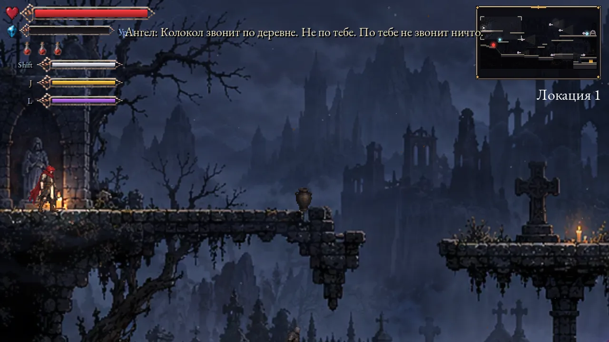
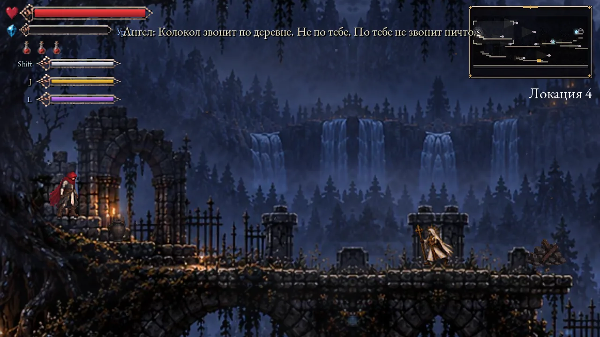
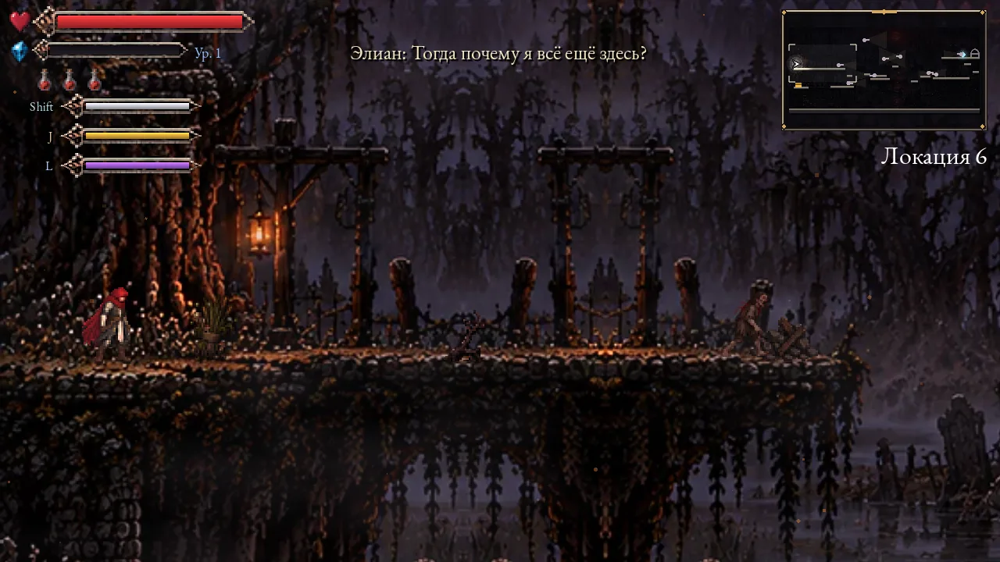
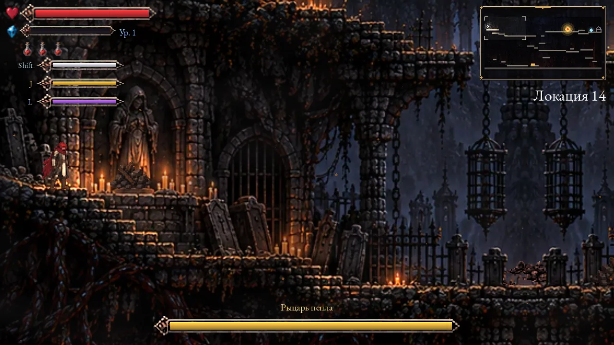
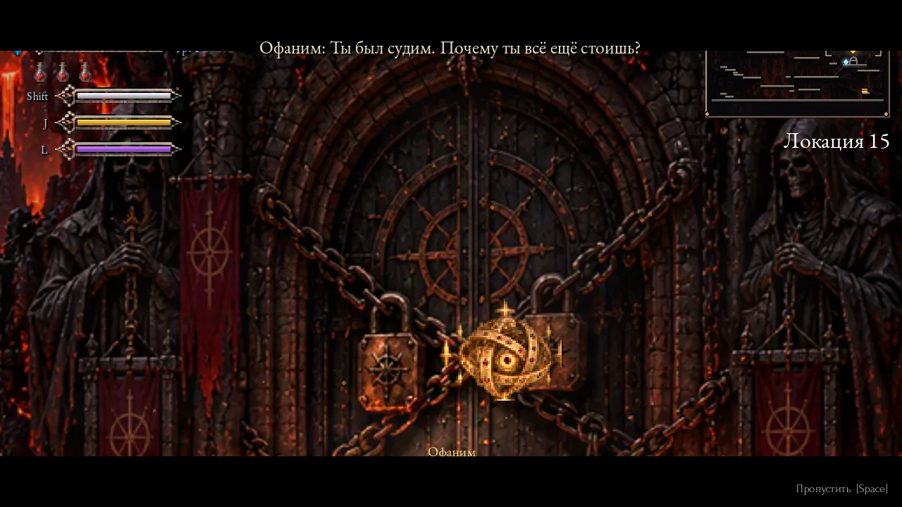
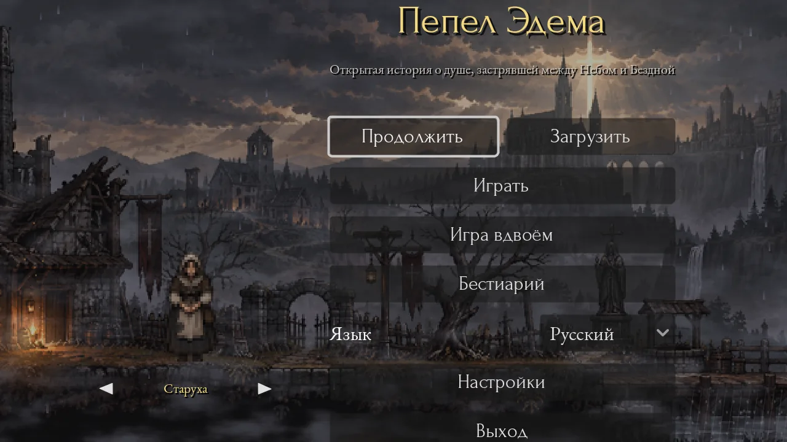
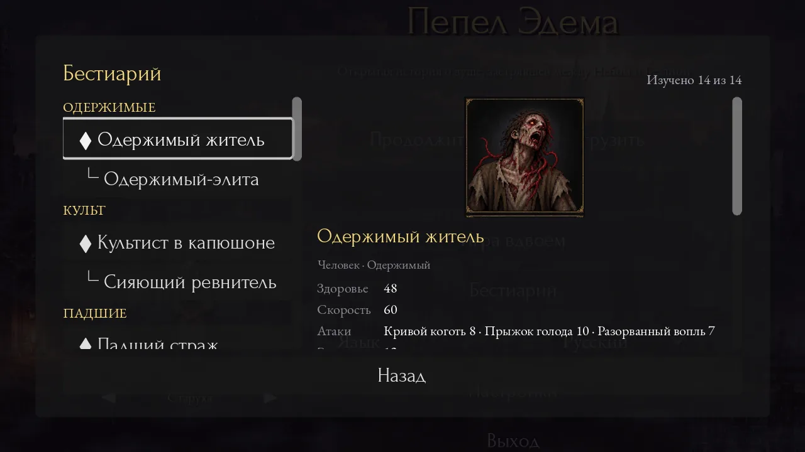

<div align="center">

# Ashes of Eden

**Пепел Эдема · Попіл Едему · 伊甸余烬**

*An open-source 2D pixel action roguelite about a human soul
that neither Heaven nor the Abyss can claim.*

[](https://github.com/Saaayurii/ashes-of-eden/actions/workflows/ci.yml)
[](LICENSE)
[](LICENSE-ASSETS.md)
[](https://godotengine.org/download)


[Русская версия README](README.ru.md) · [Design doc](docs/GDD.md) · [Roadmap](docs/ROADMAP.md) · [Contributing](CONTRIBUTING.md)



</div>

---

They hanged Elian and buried him outside the fence. He got up anyway.

Side-view, fast and forgiving in the spirit of Dead Cells on the surface; a serious, deliberately
ambiguous story underneath for anyone who wants it. You can finish the game without reading a word,
and it will still have been about something.

> **Status — prototype, `v0.1.0-dev`.** Playable start to finish: 15 rooms across 8 areas, 14 kinds of
> enemy including a mid-boss and a boss with two patterns, 36 gifts, 13 dialogue trees with branching
> the world remembers, four languages, online co-op and a 1v1 duel with crossplay.
> See [docs/ROADMAP.md](docs/ROADMAP.md) for what is not here yet.

**Free. Open source. No pay-to-win. No loot boxes.** — [how the game funds itself](docs/MONETIZATION.md)

---

## Why this one

|  |  |
|---|---|
| **Angels are not good. Demons are not evil.** | Heaven wants a world without suffering — and without choice. The Abyss wants freedom, with every consequence freedom brings. Elian is the only thing that can say *no* to both. |
| **The moment-to-moment is simple on purpose.** | Run, jump, roll, strike, parry. Clear the room, walk through the door, take a gift, repeat. |
| **The story watches you.** | Every gift and every answer quietly moves three hidden counters — Grace, Temptation, Will. The world reacts. Nobody ever shows you the numbers. |
| **Twelve different endings to one night.** | Four ways the priest's confession can go, times three ways the run can lean. None of them is the good one. |
| **Built to be forked.** | Enemies, gifts, rooms, dialogue and translations are plain JSON and CSV. You can add content without opening the engine. |
| **Bring a friend.** | The whole story can be played by two, plus a one-on-one duel. A laptop, a phone and a browser tab can share one match. |

---

## Look at it

<table>
<tr>
<td width="50%"><br><sub><b>The graveyard.</b> Three rooms, and the first person to tell you the judgement is not what it looks like.</sub></td>
<td width="50%"><br><sub><b>The swamp.</b> Where the cult wrote its letters for a man who could not read them.</sub></td>
</tr>
<tr>
<td width="50%"><br><sub><b>The Knight of Ash.</b> The ash gallery, and the last thing standing before the gate.</sub></td>
<td width="50%"><br><sub><b>The gate of the Abyss.</b> The Ophanim weighs you here — and the scales do not move.</sub></td>
</tr>
<tr>
<td width="50%"><br><sub><b>A living main menu.</b> Layered parallax, rain, and whoever you have met so far walking through it.</sub></td>
<td width="50%"><br><sub><b>The bestiary.</b> Fills in as you meet things and kill them; carries across runs.</sub></td>
</tr>
</table>

---

## The first five minutes

Elian speaks first, over a black screen: what he remembers of the rope, and where his own knowledge
stops. Then the curtain goes up, an angel tells him he should be dead, and the night starts without
ever taking your hands off the controls.

He does not learn what he was hanged for until a priest, thirteen rooms later, tells him — if you
ask. Second by second: [docs/CORE_LOOP.md](docs/CORE_LOOP.md). The whole chapter, who stands where
and which choice is remembered by whom: [docs/CHAPTER1.md](docs/CHAPTER1.md).

**Spoken lines.** The story scenes are voiced in all four languages, generated locally with
[Piper](https://github.com/OHF-Voice/piper1-gpl) — MIT, offline, no paid service, nothing leaves the
machine. They are placeholders in the same sense the generated sound effects are: a real reading
dropped in at the same path wins, and a line with no recording is simply a caption, the way the game
has always played. How the cast is put together and what replacing it takes:
[docs/VOICE.md](docs/VOICE.md).

---

## Controls

| Action | Keyboard | Gamepad | Touch |
|---|---|---|---|
| Move | `A` / `D`, arrows | left stick | virtual joystick (left half) |
| Jump / double jump | `Space` / `W` / `Up` | A | green button |
| Roll (i-frames) | `Shift` / `K` | B | blue button |
| Attack | `J` / left mouse | X | gold button |
| Block (hold) · parry (tap just before a blow lands) | `L` / right mouse | RB | pale blue button |
| Talk to somebody | `E` | A | tap the prompt |
| Skip a scene | any button | any button | tap |
| Pause / settings | `Esc` | Start | — |

Every key can be rebound in Settings.

---

## Run it

**Native editor — the way to develop it.** Install [Godot 4.7](https://godotengine.org/download) and
open `project.godot`, or:

```bash
brew install --cask godot        # macOS
make editor
```

**Docker — the same image CI uses**, for validation, tests and exports:

```bash
make image      # build the image once (~1 GB of Godot + export templates)
make validate   # check every data file and all 4 locales
make test       # headless end-to-end run of the game loop
make net-test   # two-process crossplay stand: co-op and duel, host and dedicated
make server     # dedicated host for two browsers, on ws://localhost:8910
make build      # export Windows / Linux / macOS / Web into ./build
make web        # export Web and serve it at http://localhost:8080
make android    # debug-signed test APK (needs `make android-image` first)
```

<details>
<summary><b>Regenerating the generated assets</b></summary>

Art, sound and speech are all built by deterministic scripts, so none of it has to be committed by
hand and regenerating does not churn the repository:

```bash
python3 tools/audio/generate_voices.py     # one voice per creature: alert / attack / hurt / death
python3 tools/audio/generate_sfx.py        # the placeholder sound effects
python3 tools/audio/generate_speech.py     # spoken story lines, 4 languages (needs pip install 'piper-tts[zh]', see docs/VOICE.md)
python3 tools/rooms/generate_rooms.py      # the generated rooms
python3 tools/rooms/painted_rooms.py       # the hand-painted ones
python3 tools/art/make_secret_walls.py     # the bricked-up walls over the secrets
```

The screenshots in this README come out of the game itself:

```bash
godot --path . -s scripts/tools/promo_screenshots.gd -- /tmp/shots   # windowed, not headless
```

</details>

---

## Playing together

Main menu → **Play together**. One of you picks *Story together* or *Duel* and presses
**Create game**; the screen shows an address to read out. The other types it in and presses **Join**.
Both press Ready, the host presses Start. Default port is `8910`.

It is crossplay both ways: the transport is WebSocket, so one desktop host can serve a browser and a
phone at once. A browser cannot host — it cannot listen for connections — so if you are both in a
browser, run the dedicated referee:

```bash
make server                                           # ws://localhost:8910
godot --headless -- --server --port=8910 --mode=pvp   # without Docker
```

What the host decides versus what your own game decides: [docs/MULTIPLAYER.md](docs/MULTIPLAYER.md).

---

## Project layout

```
data/            the game as JSON — abilities, enemies, dialogues, cutscenes, chapters, notes
localization/    strings.csv with en / ru / uk / zh_CN columns
scenes/          Godot scenes: player, enemies, rooms, run, UI
scripts/
  autoload/      global systems: EventBus, Data, Game (run state), Audio, Settings, Net, Profile
  combat/        AbilitySystem — applies the data-driven gifts to the player
  pvp/           duel.gd — the 1v1 match, rounds and score
  tools/         validators, smoke tests and screenshot helpers (headless, used by CI)
assets/
  audio/voice/   spoken story lines, one folder per locale (tools/audio/generate_speech.py)
  shaders/       fog and water, used by the rooms and the menu
tools/
  audio/         sound, music and speech generators, plus the voice cast
  rooms/         room generators, painted and procedural
  art/           sprite and prop builders
  docker/        entrypoint and nginx config for the build image
content/         (git-ignored) official asset overlay from the private content repo — optional
docs/            GDD, core loop, chapter I, voice, monetization, roadmap, data formats, localization
```

---

## Contributing

Translations, gifts, enemies and dialogue are the easiest places to start — most of them need no
engine at all, just a JSON or CSV file. See [CONTRIBUTING.md](CONTRIBUTING.md) and
[docs/DATA_FORMATS.md](docs/DATA_FORMATS.md). CI validates every pull request: data files, all four
locales, and a headless run of the whole game loop.

Particularly wanted right now: a second pass over the Chinese text by a native speaker
([docs/LOCALIZATION_REVIEW.md](docs/LOCALIZATION_REVIEW.md)), and real recorded voice work
([docs/VOICE.md](docs/VOICE.md)).

---

## License

**Code:** [MIT](LICENSE). **Story text and translations:** CC BY 4.0. **Third-party assets:** CC0 /
CC BY / OFL only, each one credited in [`assets/CREDITS.md`](assets/CREDITS.md).

Official art, music and the name are reserved and live outside this repository — see
[LICENSE-ASSETS.md](LICENSE-ASSETS.md). A build without them is the fully playable community edition.

Fork it, mod it, port it, learn from it, ship your own game on this code.
